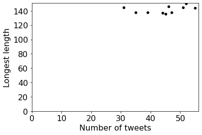
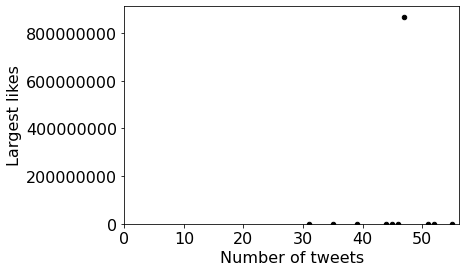
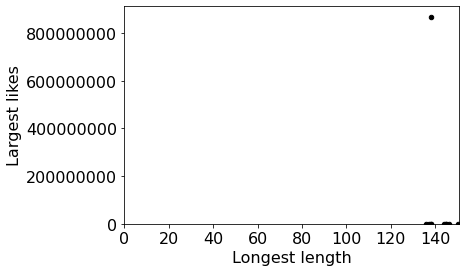
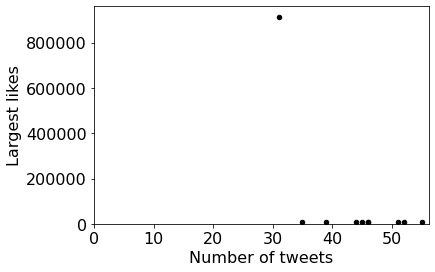
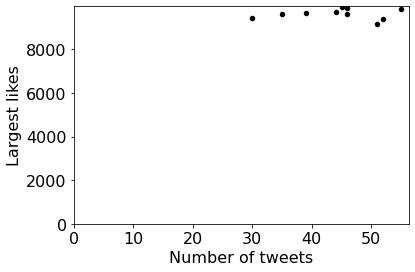

# Project 11: Twitter, Stage 2


## Clarifications/Corrections

November 16: revised the description of the q14.

November 17: added description to q9.

November 18: modified `cleanMAC.py` to make it work properly; modified the hint in q6 to make it clearer.

**Find any issues?** Report to us:  

- Liang Shang <lshang6@wisc.edu>
- Winfred Li <wli525@wisc.edu>
- Cheng-Wei Lu <clu232@wisc.edu>

## Learning Objectives

In this project, you will

- Gain more experience with using dictionaries;
- Practice handling errors;
- Practice using namedtuples;
- Practice makeing scatter plots using pandas;
- Practice writing recursive functions.

## Coding Style Requirements

Remember that coding style matters! **We might deduct points for bad coding style.** Here are a list of coding style requirements:

- Do not use meaningless names for variables or functions (e.g. uuu = "my name").
- Do not write the exact same code in multiple places. Instead, wrap this code into a function and call that function whenever the code should be used.
- Do not call unnecessary functions.
- Avoid using slow functions multiple times within a loop.
- Avoid inappropriate use of data structures.
- Don't name the variables and functions as python keywords or built-in functions. Bad example: str = "23".
- Don't define multiple functions with the same name or define multiple versions of one function with different names. Just keep the best version.
- Put all import commands together in the second cell of main.ipynb, the first cell should be submission information (netid and etc).
- Think twice before creating a function without any parameters. Defining a new functions is unnecessary sometimes. The advantage of writing functions is that we can reuse the same code. If we only use this function once, there is no need to create a new function.
- Don't use absolute paths such as C://Desktop//220. Please use relative paths. When we test your work on a different operating system, all of the test will fail and you will get a 0. Don't panic when you see this, please fix the errors and resubmit your assignment.  Contact your TA if you need assistance with this task.

## Setup

**Step 1:** Download [`tweets.zip`](https://github.com/msyamkumar/cs220-f20-projects/tree/master/p11/tweets.zip) and [`recursive.zip`](https://github.com/msyamkumar/cs220-f20-projects/tree/master/p11/recursive.zip) and extract them to a directory on your computer (using [Mac directions](http://osxdaily.com/2017/11/05/how-open-zip-file-mac/) or [Windows directions](https://support.microsoft.com/en-us/help/4028088/windows-zip-and-unzip-files)).

**Step 2:** Download [`test.py`](https://github.com/msyamkumar/cs220-f20-projects/tree/master/p11/test.py)  to the directory from step 1 (`test.py` be next to the `sample_data` directory, for example)

**Step 3:** Create a `main.ipynb` in the same location.  Do all work for both stages there, and turn it in when complete.

**Step 4**: Download [`cleanMAC.py`](https://github.com/msyamkumar/cs220-f20-projects/tree/master/p11/cleanMAC.py) in the same location. Create a new cell in your `main.ipynb` and copy the following code 

```python
from cleanMAC import * 
# clean the .DS_Store file
clean()
```

to this cell. This is because MacOS will produce a file named .DS_Store automatically, which may make you fail to pass the tests. MacOS produces a file named .DS_Store automatically. This may cause the tests to fail.

Note: Make sure `full_data`, `sample_data`, `play`, `recursive`, `main.ipynb` and `test.py` are in same directory.

## Introduction

In this project, you'll be analyzing the clean data from p10. 

* Some files will be CSVs, others JSONs
* Data is spread across multiple files and multiple levels of sub directories
* Data may contain outliers 
* Some integer values may be represented as strings with a suffix of "M", "K", or similar

Please feel free to copy and use your functions from p10. However, since you are only allowed to submit a single jupyter notebook, please **do not** directly `import` your functions from p10. 

For this project, you'll create a new `main.ipynb` and answer questions in the usual format. **Please go through the [lab-p11](https://github.com/msyamkumar/cs220-f20-projects/tree/master/lab-p11) before working on this project.** The lab guides you through making helper functions and introduces some useful techniques related to this project.

## Questions

Through question 13, everything is about the data in `full_data`.  Use
your code from last time to answer the questions (this means you'll
ignore corrupt data, as in p10).

**Note:** you'll learn about making scatter plots in lab 11, so please
  don't ask about how to do that until we've released that lab and
  you've had a chance to work through it.

#### #q1: How many tweets are present in total?

#### #q2: Which usernames appear in the dataset?

Answer in the form of a `set`.

#### #q3: How **prolific** is each user?

Answer with a `dict` that maps username to the number of tweets by that user.

#### #q4: What is the largest number of likes received on a tweet for each user?

Answer with a `dict` that maps username to the largest number of likes by that user. Make sure all values in this `dict` are integers.

Hint: Your function from p10 #q20 converted the num_liked into an integer.

#### #q5: What is the length of the longest tweet for each user?

Answer with a `dict` that maps username to the length of that tweet.

#### #q6: What is the relationship between the number of tweets by a user and the length of their longest tweet?

Answer with a scatter plot showing 10 points (one per user). The x-axis represents the number of tweets, and the y-axis represents the length. It should look like this:



The dictionaries you will need to plot are:

```python
{'USERID_1': 52,
 'USERID_7': 55,
 'USERID_10': 45,
 'USERID_9': 44,
 'USERID_4': 35,
 'USERID_6': 51,
 'USERID_3': 39,
 'USERID_2': 47,
 'USERID_5': 46,
 'USERID_8': 31}
```
 ```python
 {'USERID_1': 150,
 'USERID_7': 144,
 'USERID_10': 136,
 'USERID_9': 137,
 'USERID_4': 138,
 'USERID_6': 145,
 'USERID_3': 138,
 'USERID_2': 138,
 'USERID_5': 146,
 'USERID_8': 145}
 ```

Hint: you can directly put your `dict` into the scatter function from lab-p11. The dictionary we put here is for you to check whether the data of your graph is correct. **Don't simply copy the dictionary we provide to your notebook!**

Make sure to label the vertical axis with an informative name for all your graphs!

#### #q7: What is the relationship between the number of tweets and the largest number of likes?

Answer with a scatter plot showing 10 points (one per user). The x-axis represents the number of tweets, and the y-axis represents the largest number of likes. It should look like this:



The dictionaries you will need to plot are:

```python
{'USERID_1': 52,
 'USERID_7': 55,
 'USERID_10': 45,
 'USERID_9': 44,
 'USERID_4': 35,
 'USERID_6': 51,
 'USERID_3': 39,
 'USERID_2': 47,
 'USERID_5': 46,
 'USERID_8': 31}
```
 ```python
{'USERID_1': 9393,
 'USERID_7': 9851,
 'USERID_10': 9936,
 'USERID_9': 9728,
 'USERID_4': 9618,
 'USERID_6': 9149,
 'USERID_3': 9678,
 'USERID_2': 869000000,
 'USERID_5': 9608,
 'USERID_8': 915000}
 ```

#### #q8: What is the relationship between the length of their longest tweet and the largest number of likes?

Answer with a scatter plot showing 10 points (one per user). The x-axis represents the length, and the y-axis represents the largest number of likes. It should look like this:



The dictionaries you will need to plot are:

```python
 {'USERID_1': 150,
 'USERID_7': 144,
 'USERID_10': 136,
 'USERID_9': 137,
 'USERID_4': 138,
 'USERID_6': 145,
 'USERID_3': 138,
 'USERID_2': 138,
 'USERID_5': 146,
 'USERID_8': 145}
```
 ```python
{'USERID_1': 9393,
 'USERID_7': 9851,
 'USERID_10': 9936,
 'USERID_9': 9728,
 'USERID_4': 9618,
 'USERID_6': 9149,
 'USERID_3': 9678,
 'USERID_2': 869000000,
 'USERID_5': 9608,
 'USERID_8': 915000}
 ```

#### #q9: What is the username of the user represented by the outlier in the last two plots?

In [statistics](https://en.wikipedia.org/wiki/Statistics), an **[outlier](https://en.wikipedia.org/wiki/Outlier)** is a [data point](https://en.wikipedia.org/wiki/Data_point) that differs significantly from other observations. **Note that you are not allowed to hardcode the index of the ourlier.** You don't need any other statistical/mathematical knowledge to find the outlier. You don't need to write any specific algorithm. What you need to do is figure out the approximate range of this outlier from the graph you drawed, and then use `if` statement to filter out this point.

#### #q10: What are the tweets made by that outlier user?

Answer with a list of Tweet objects, sorted by num_liked in descending order.

The first 5 tweets of the expected output are:

```python
[Tweet(tweet_id='1467894593', username='USERID_2', num_liked='869M', length=136),
 Tweet(tweet_id='1467875163', username='USERID_2', num_liked=9891, length=69),
 Tweet(tweet_id='1467862806', username='USERID_2', num_liked=9465, length=68),
 Tweet(tweet_id='1467907751', username='USERID_2', num_liked=9048, length=110),
 Tweet(tweet_id='1467928764', username='USERID_2', num_liked=9026, length=41)]
```

#### #q11: If we exclude that most-liked tweet, what is the average of the remaining number of likes for that user?

#### #q12: If we exclude that most-liked tweet, what is the relationship between the number of tweets and the largest number of likes?

Answer with a scatter plot showing 10 points (one per user). The x-axis represents the number of tweets, and the y-axis represents the largest number of likes. It should look like this:



The dictionaries you will need to plot are:

```python
{'USERID_1': 52,
 'USERID_7': 55,
 'USERID_10': 45,
 'USERID_9': 44,
 'USERID_4': 35,
 'USERID_6': 51,
 'USERID_3': 39,
 'USERID_2': 46,
 'USERID_5': 46,
 'USERID_8': 31}
```
 ```python
{'USERID_1': 9393,
 'USERID_7': 9851,
 'USERID_10': 9936,
 'USERID_9': 9728,
 'USERID_4': 9618,
 'USERID_6': 9149,
 'USERID_3': 9678,
 'USERID_2': 9891,
 'USERID_5': 9608,
 'USERID_8': 915000}
 ```

#### #q13: If we exclude the 2 most-liked tweets, what is the relationship between the number of tweets and the largest number of likes?

Answer with a scatter plot showing 10 points (one per user). The x-axis represents the number of tweets, and the y-axis represents the largest number of likes. It should look like this:



The dictionaries you will need to plot are:

```python
{'USERID_1': 52,
 'USERID_7': 55,
 'USERID_10': 45,
 'USERID_9': 44,
 'USERID_4': 35,
 'USERID_6': 51,
 'USERID_3': 39,
 'USERID_2': 46,
 'USERID_5': 46,
 'USERID_8': 30}
```
 ```python
{'USERID_1': 9393,
 'USERID_7': 9851,
 'USERID_10': 9936,
 'USERID_9': 9728,
 'USERID_4': 9618,
 'USERID_6': 9149,
 'USERID_3': 9678,
 'USERID_2': 9891,
 'USERID_5': 9608,
 'USERID_8': 9462}
 ```

----

Write a function that takes a directory path as a parameter,
recursively explores that directory for any files (which might be
buried in many levels of sub directories), and finally returns a list
of paths to files inside that directory.  **The paths should be sorted
in reverse-alphabetical order.  Exclude any files with names beginning
with `.`.**

**Important:** there are Python functions that can do this for you
  (for example, https://docs.python.org/3/library/os.html#os.walk),
  but you need to write the recursive code for yourself.  If you use
  one of these existing implementations, we'll deduct any points you
  get for the remaining questions.

Your function MAY use the following:
* `os.listdir`
* `os.path.join`
* `os.path.isfile`
* `os.path.isdir`

Use your function to answer the following questions. An example answer will have the form of:

```python
['play/rb/rb9/89.csv', 'play/rb/rb9/12.xls']
```
The appearance of your results may differ a little bit depending on your operating system. **Make sure you use os.path.join to take care of these operating system differences. **

----

#### #q14: What are the files in the `rb8` directory of the `rb` directory of the `play` directory?

Answer this question with a list of realtive path.

#### #q15: What are the files in the `ou` directory of the `play` directory?

Answer this question with a list of realtive path.

#### #q16: What are the files in the `play` directory?

Answer this question with a list of realtive path.

#### #q17: What are the files in the `others` directory of the `recursive` directory?

Answer this question with a list of realtive path.

#### #q18: What are the files in the `recursive` directory?

Answer this question with a list of realtive path.

#### #q19: How many tweets are in the files in the `USERID_4` directory of the `recursive` directory?

Answer this question with an integer.

#### #q20: How many tweets are in the files in the `recursive` directory?

Please answer this question with an integer.

### After you add your name and the name of your partner to the notebook in the first cell, please remember to Kernel->Restart and Run All to check for errors then run the test.py script one more time before submission. To keep your code concise, please remove your own testing code that does not influence the correctness of answers.

Cheers!
